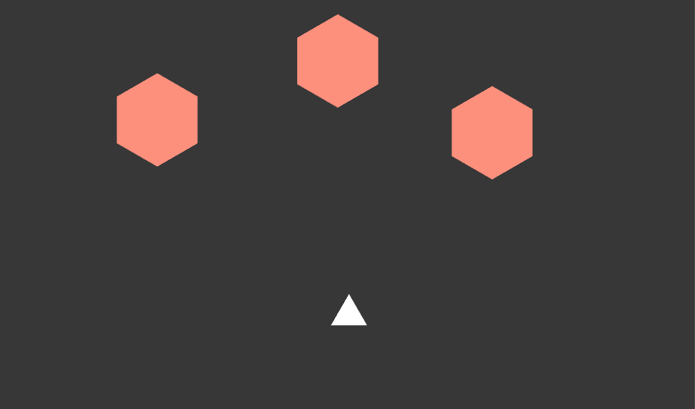

#Asteroid Test

Currently a repo to hold a smiple asteroid-dodging game. See "Project" tab in GitHub for status and roadmap.

The code will be quite ugly, as I haven't touched C# before. Same with Unity, if that wasn't obvious already! 

Here's a screenshot of what it looks like right now:

Spectacular, I know. 

## Objective
The objective is to dodge pink/red hexagons and push blue hexagons upwards, off the screen. Or to some predefined boundary, depending on which I want to implement.
